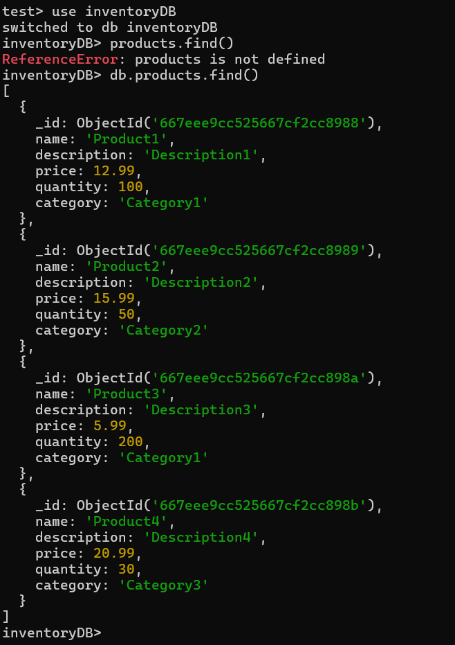

1. Install mongodb and mongosh
2. open mongosh
3. enter the following commands
        mongo   //Establishes a connection to a db in mongodb
        use inventoryDB
        db.createCollection("products")
        db.products.insertMany([
        { name: "Product1", description: "Description1", price: 10.99, quantquantity: 100, category: "Category1" },
        { name: "Product2", description: "Description2", price: 15.99, quantquantity: 50, category: "Category2" },
        { name: "Product3", description: "Description3", price: 5.99, quantiquantity: 200, category: "Category1" },
        { name: "Product4", description: "Description4", price: 20.99, quantquantity: 30, category: "Category3" },
        { name: "Product5", description: "Description5", price: 25.99, quantquantity: 10, category: "Category2" }
        ])

    // now we have created a product database collection under the name products

4. Interaction with the created db

        db.products.find() //outs all the products we added
        db.products.find({price : {$lt: 12.00}}) // finds products with the price attribute less than 12.00
        db.products.find({ quantity: { $gt: 50 } }) // finds products with quantity over 50

        db.products.updateOne({ name: "Product1" }, { $set: { price: 12.99 } }) // sets the price pf teh chosen product to 12.99

        db.products.deleteOne({ name: "Product5" }) // delets the selected product

5.   refer the image to see the changes we have made to the added database
         

