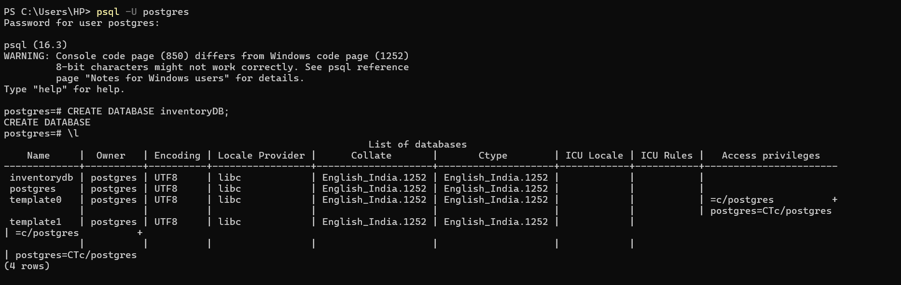
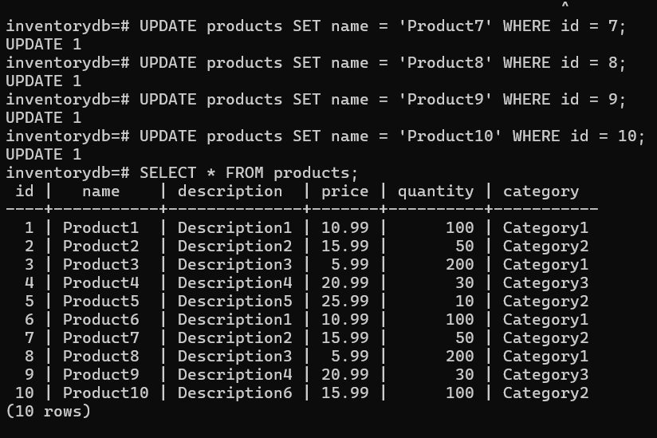
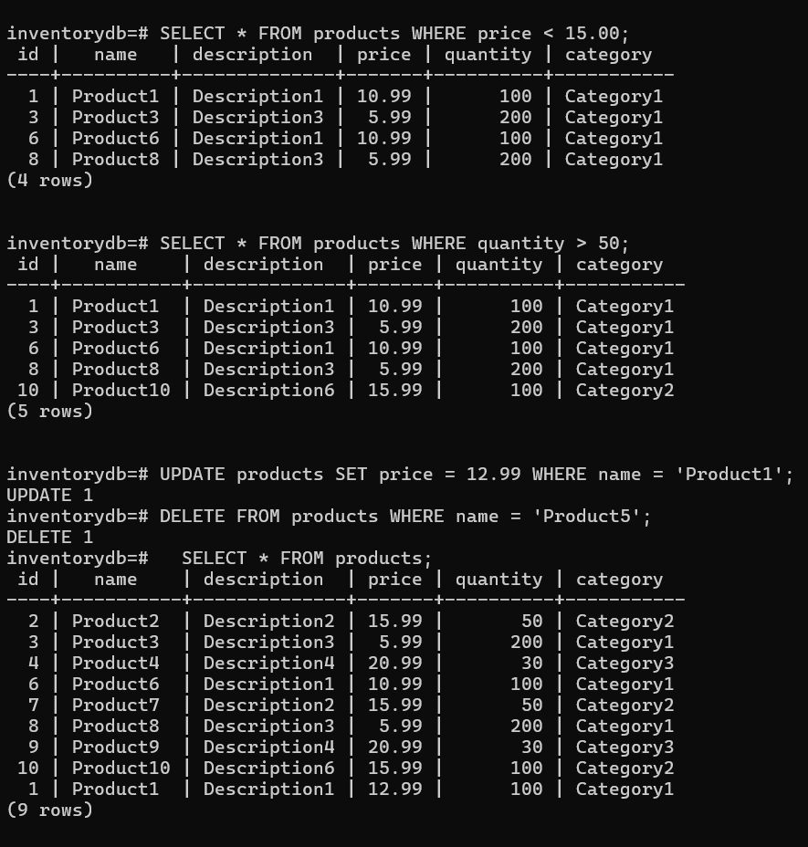

1. Download PostgreSQL from the official website and complete the setup
2. add the app path to your environment variables
3. open Command Prompt and enter the followjing commands

    psql -U postgres
    <Enter your Password>

    CREATE DATABASE inventorydb; // creates a database under the name inventorydb
    \l  //to view all the databases
    
    

    \c inventorydb // changes into the db selected

    CREATE TABLE products (
     id SERIAL PRIMARY KEY,
     name VARCHAR(50),
     description TEXT,
     price DECIMAL(10, 2),
     quantity INT,
     category VARCHAR(50)
    );
    // creates a table called products with the values we gave and their datatypes

    \dt   //to view all the tables  
    \d products // to view the products table's skeleton

    INSERT INTO products (name, description, price, quantity, category) VALUES
     ('Product1', 'Description1', 10.99, 100, 'Category1'),
     ('Product2', 'Description2', 15.99, 50, 'Category2'),
     ('Product3', 'Description3', 5.99, 200, 'Category1'),
     ('Product4', 'Description4', 20.99, 30, 'Category3'),
     ('Product5', 'Description5', 25.99, 10, 'Category2');

    // inserts the values into table

    UPDATE products SET name = 'Product10' WHERE id = 10; // updates the item id 10's name to specified name

    

    SELECT * FROM products; //Retrieve All Products 
    SELECT * FROM products WHERE price < 15.00;   // Retrieve Products with Price Less Than a Specified Amount
    SELECT * FROM products WHERE quantity > 50;  // SELECT * FROM products WHERE quantity > 50;
    DELETE FROM products WHERE name = 'Product5'; // Delete a Product from the Table

    

4. To delete the database created, go to another database and delete it using DROP DATABASW

    \c postgres
    DROP DATABASE <db_name>
